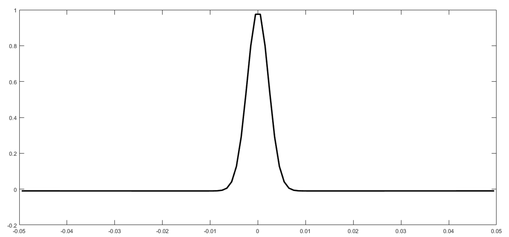

# Create New Broad Band Ricker wavelet

## 创建余氏子波

### 输入参数

```py
pp = 6                  #俞氏子波低截频 Hz
q = 100                 #俞氏子波高截频 Hz
sample_rate = 0.001     #子波采样率 s
wavelet_length = 100    #子波长度  ms
```

### 调用函数

```python
t, ww = yuh_shu(q, pp, sample_rate, wavelet_length)
```

### 返回值为向量



