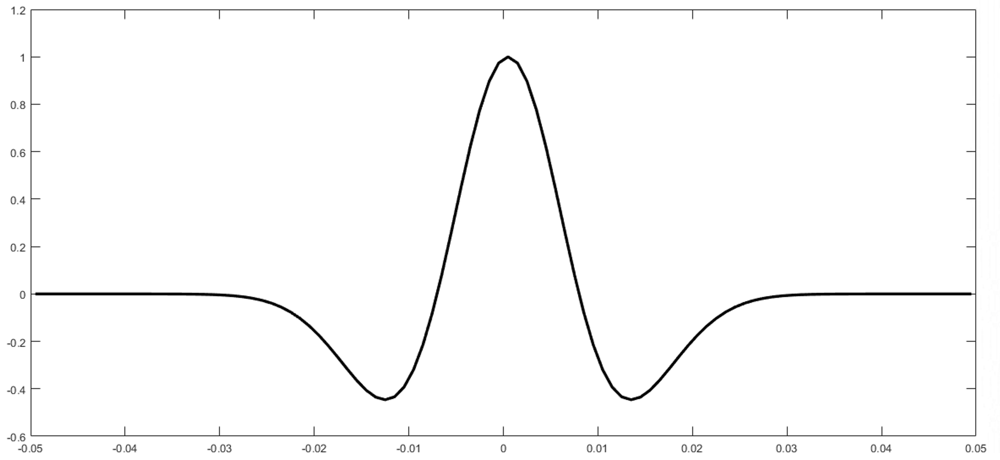

# Create New Ricker Wavelet

## 创建雷克子波

### 输入参数

```py
Dominant_Frequency = 30;    # 子波主频 Hz
Sample_Rate = 0.001;       	# 子波采样率 s
Phase_Rotation = 0;        	# 子波相对  degrees
Wavelet_Length = 100;   		# 子波长度  ms
```

### 调用函数

```python
w= Ricker(Sample_Rate,Wavelet_Length,1,Dominant_Frequency,Phase_Rotation * pi / 180);
```

### 返回值为向量



