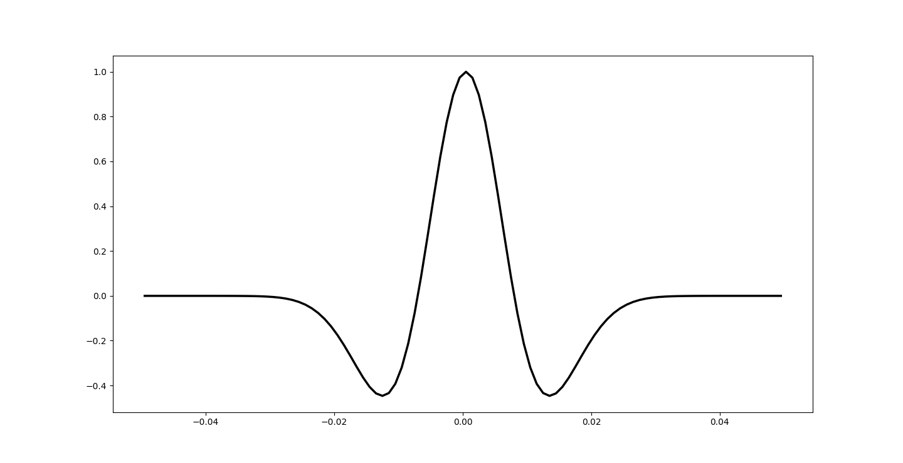

# Create New Ricker Wavelet

## 创建雷克子波

### 输入参数

```py
dominant_frequency = 30     # 子波主频 Hz
sample_rate = 0.001         # 子波采样率 s
phase_rotation = 0          # 子波相对  degrees
wavelet_length = 100        # 子波长度  ms
```

### 调用函数

```python
w = ricker(sample_rate, wavelet_length, 1, dominant_frequency, phase_rotation * np.pi / 180)
```

### 返回值为一位向量



