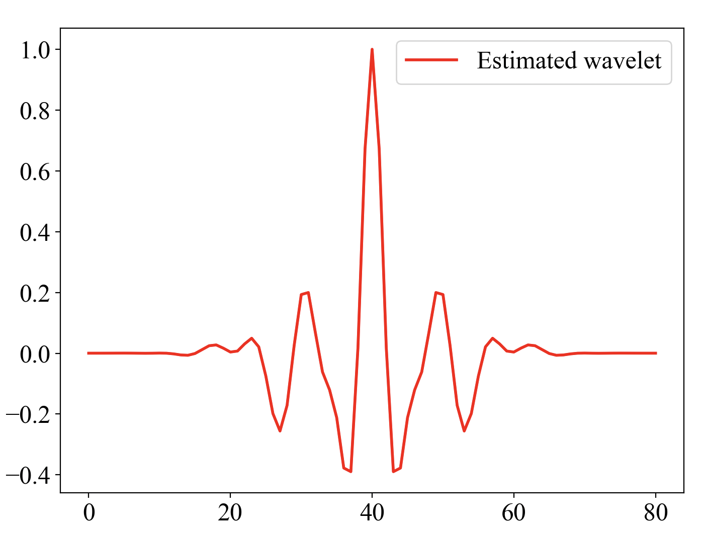

# Extract Statistical Wavelet

## 利用光滑地震数据的频谱来提取地震子波

### 输入参数

```py
seis  # 地震数据
dominant_frequency = 30     # 子波主频 Hz
dt = 0.001         # 子波采样率 s
L_w = 81         # 子波长度  ms

```

### 调用函数

```python
wmin_esti, wzero_esti = fit_amplitude2min_zero_wavelet2D(seis, dt, L_w, 30)
```

### 返回值 `wzero_esti`为向量



